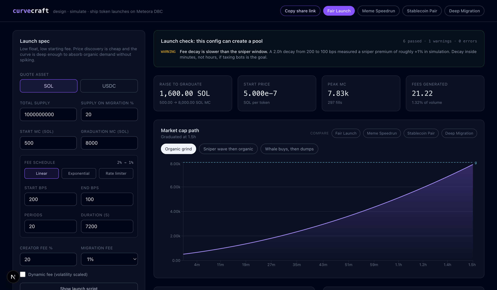

# CurveCraft

**Design, simulate and ship token launches on Meteora's Dynamic Bonding Curve.**

Most token launches pick a curve by vibes and find out what they picked once the money is on
chain. CurveCraft compiles a launch into a real DBC config, replays realistic demand against it
with the official Meteora swap math, and hands you a runnable launch script.

**Demo video (3 min):** <https://ak-blank.github.io/curvecraft/demo/> · **Studio:** <https://ak-blank.github.io/curvecraft/studio/> · **Presets:** [marketplace](https://ak-blank.github.io/curvecraft/presets/) · **Live pools:** [mainnet snapshot](https://ak-blank.github.io/curvecraft/pools/)

Built for the [Colosseum Crypto World's Fair](https://www.colosseum.com/worldsfair) hackathon —
Meteora DBC sidetrack.



*The studio after replaying a launch: raise to graduate, market-cap path with the graduation line,
scenario scoreboard with the sniper premium, and the pre-deploy check.*

---

## Why this exists

A DBC launch has ~15 parameters that interact: start price, graduation market cap, fee schedule
shape, dynamic fees, migration split, liquidity distribution. Two launches with the same market
caps but different fee schedules behave nothing alike — one taxes snipers, the other subsidises
them, and you cannot tell which from the config screen.

CurveCraft answers the question a founder actually asks: **"under realistic demand, who pays what,
and when does this thing graduate?"**

## What it does

1. **Design** — edit the launch spec: quote asset, supply, start/graduation market cap, **curve
   shape** (market cap / flat / long-linear / exponential, built from sixteen weighted segments),
   fee mode (linear / exponential / rate limiter), fee schedule, dynamic fee, migration fee and
   creator fee.
2. **Simulate** — three demand scenarios scaled to *your* graduation target are replayed fill by
   fill:
   - *Organic grind* — 400 buys spread over two hours.
   - *Sniper wave then organic* — 60 bots in the first ten seconds, then real demand.
   - *Whale buys, then dumps* — a large buyer takes profit into the curve.
3. **Compare** — the scoreboard reports peak market cap, effective fee rate and graduation time per
   scenario, plus the fee delta versus organic demand. That delta is the number that tells you
   whether your "anti-sniper" schedule actually taxes snipers.
   Toggle up to three other presets into **head-to-head** mode to replay the same demand against
   every design at once, and see each one's raise target, fee rate, sniper premium and graduation
   time side by side.
4. **Check** — every design runs through the DBC program's own rules before it can be exported:
   LP percentages, minimum locked liquidity at day 1, curve monotonicity, fee schedule, migration
   fee, and whether the config is allowed to create pools at all. Errors block; policy warnings
   come from measured simulator behaviour (for example, a fee decay that is too slow to tax
   snipers).
5. **Ship** — export a TypeScript script that creates the config on chain via
   `@meteora-ag/dynamic-bonding-curve-sdk`. Every design is also encoded into its own URL, so a
   config can be handed to a co-founder or put to a community vote without a backend.

## The numbers are not a toy model

CurveCraft does **not** re-implement bonding curve math. Every fill is quoted by the official SDK
(`client.pool.swapQuote2`), and the simulator walks the curve by feeding each quote's
`nextSqrtPrice` back in as the starting state. The fee scheduler reads the scenario clock, so a
time-decaying fee behaves exactly as it does on chain. If the SDK says a trade pays 2.5%, the
simulation reports 2.5%.

```
spec ──buildCurveWithMarketCap──► ConfigParameters ──normalizeQuoteConfig──► quote-ready config
                                                                                    │
scenario ──► for each trade ──► swapQuote2(virtualPool, config, amountIn) ──► price, fee, nextSqrtPrice
                     ▲                                                                    │
                     └──────────────────────── pool.poolState.sqrtPrice ◄──────────────────┘
```

## Finding one: the sniper premium

| Preset | Effective fee (organic) | Effective fee (sniper wave) | Sniper tax |
|---|---|---|---|
| Fair Launch (2% → 1% linear, 20 periods, 2h) | 1.323% | 1.336% | +1.0% |
| Meme Speedrun (20% → 1% exponential, 12 periods, 30m) | 2.481% | 3.019% | **+21.7%** |
| Deep Migration (2.5% → 1.2% linear, 16 periods, 4h) | 1.839% | 1.847% | +0.4% |
| Stablecoin Pair (1.5% → 0.8% linear, 24 periods, 24h) | 1.192% | 1.193% | +0.0% |

A slow linear decay barely changes what snipers pay. A short, steep exponential decay does — at the
cost of charging organic buyers 2.5× more than the flat schedule. That trade-off is the design
decision, and now it is visible before deployment.

## Finding two: ambitious graduation targets are cheap

`buildCurveWithMarketCap` does not scale the raise linearly with the graduation
market cap. Measured with a fixed 500 SOL start and 20% of supply on the curve:

| Graduation MC | Raise to graduate | vs previous row |
|---|---|---|
| 2,000 SOL | 666.7 SOL | — |
| 4,000 SOL | 1,044.8 SOL | ×1.57 |
| 8,000 SOL | 1,600.0 SOL | ×1.53 |
| 16,000 SOL | 2,403.5 SOL | ×1.50 |
| 32,000 SOL | 3,555.6 SOL | ×1.48 |
| 64,000 SOL | 5,197.5 SOL | ×1.46 |

Every doubling of the graduation target costs about **1.5×** the raise, not 2×. A
founder who wants a 64,000 SOL graduation instead of 8,000 SOL needs 3.2× the
raise for 8× the headline valuation. `tests/core.test.ts` pins this behaviour so a
dependency upgrade cannot silently change it.

## Finding four: the curve shape moves the raise by ±30%

Same start market cap, same graduation market cap, same supply — only the curve shape changes
*(measured)*:

| Curve shape | Raise to graduate | vs market-cap curve |
|---|---|---|
| Market cap (single segment) | 1,600.0 SOL | — |
| **Flat** (deep early liquidity, 16 segments) | **1,172.4 SOL** | **−27%** |
| Long / linear (16 even segments) | 1,598.4 SOL | −0.1% |
| **Exponential** (thin early liquidity) | **2,130.8 SOL** | **+33%** |

A flat curve keeps the price low while supply sells, so the same headline valuation is reached with
a third less capital — and it charges 27% less in fees along the way (15.55 SOL vs 21.22 SOL on the
same demand). An exponential curve buys faster price discovery and pays for it.

This is the shape of the "Flat Curve / Exponential Curve / Long Curve" idea Meteora asks for, with
the trade-off measured instead of asserted. Reproduce with `npm run shapes`.

## Finding three: every preset we shipped was undeployable

Writing the launch check paid for itself immediately. The DBC program requires **at least 10% of
migrated liquidity to be locked at day 1** (`MIN_LOCKED_LIQUIDITY_BPS = 1000`), and all four of our
original presets shipped a `100% liquid / 0% locked` split — they would have failed at
`createConfig`, after the founder had already announced a date.

The lint now runs the SDK's own validators (`validateMinimumLockedLiquidity`, `validateCurve`,
`validatePoolFees`, `assertConfigAllowsNewPool`, `validateMigrationFee`) against every design, and
`tests/core.test.ts` asserts that every preset in the marketplace passes. A config UI cannot infer
these rules; a launch tool that does not check them is a liability.

## Finding five: real launches either graduate or die, and half of them break the lock rule

The presets are opinions. This is the evidence behind them: `npm run pools:analyze` enumerates live
VirtualPool accounts on mainnet, rebuilds each launch's config with the same decoder the studio uses,
and reports what founders actually chose. The sample is taken in account-address order rather than by
activity, so it is not skewed toward whoever traded last *(measured 2026-10-01, 200 pools)*:

| | share / median |
|---|---|
| Quote asset | SOL 84.0% · USDC 16.0% · **another token 0%** |
| Migration target | dammV2 93.5% · dammV1 6.5% |
| Fees collected in the quote asset | 45.0% |
| **Migration fee preset** | **600 bps on 52.5%** (100 bps 21.5%, 30 bps 14.0%, 25 bps 11.5%) |
| Base swap fee | 25 bps (p75 100) |
| Creator trading fee | 50% (p25 0%, p75 100%) |
| Creator permanently locked | 0% (p75 50%) |
| Starting market cap | $39 (p75 $170) |
| Market cap at migration | $500 (p75 $9.0k) |
| Raise to graduate | 83.7 quote (p75 85.0) |
| **Graduated** | **52.0%** |
| **Raised under 10% of target** | **48.0%** |
| **Between 10% and 99%** | **0.0%** |

Four things fall out of this.

**The distribution is bimodal, not a gradient.** Half the launches graduate and half never clear 10%
of their raise; nothing sits in between, because a curve that is not being bought does not drift
sideways — it stops. A tool that reports a single graduation probability hides the shape of that
risk, which is why the report shows the distribution over sampled paths rather than one number.

**Half the configs on mainnet do not meet the program's own lock rule.** The program requires at
least 1000 bps (10%) of migrated liquidity to still be locked one day after migration
(`MIN_LOCKED_LIQUIDITY_BPS`), and 102 of the 200 decodable configs hold less — median 100 bps. The
permanent-locked percentages alone do not answer this, because vesting counts: a config can show 0%
permanently locked and still pass. We call the SDK's `calculateLockedLiquidityBpsAtTime` with the
account's own vesting fields instead of re-deriving the rule. The most likely reading is that those
configs were created before the rule was enforced and remain live; whatever the cause, it is the
argument for a launch tool that runs the validator rather than copying the last launch that worked.

**Deployed configs are still more aggressive than our presets.** The market's modal migration fee is
600 bps, six times the 100 bps every one of our presets uses, and the median creator takes 50% of
trading fees against our 10–30%. Those configs are optimizing the first hour of a meme; the presets
are optimizing a launch that has to survive its own migration. But it means the preset marketplace
should ship an explicitly degen profile rather than presenting the conservative defaults as neutral.

**The pair space Meteora wants built is genuinely empty.** Across the 200 sampled pools, 84% quote
SOL and 16% quote USDC — **not one quotes another token.** Stock pairs, ICM pairs and RWA pairs are
not crowded categories with a few incumbents; they are unoccupied. That is the strongest argument for
the ICM pair preset we added, and it is measured rather than assumed.

Reproduce with `npm run pools:analyze` or `npm run pools:analyze 200` (needs a key that allows a
filtered server-side enumeration — see [Reading mainnet](#reading-mainnet-the-solami-data-path)).

## Verified against the program, not just against itself

Simulating a launch in a browser proves the simulator is self-consistent. To
prove the *output* is deployable, `npm run verify:mainnet` builds the exact
transaction the generated launch script builds and simulates it against mainnet
state (funded fee payer, `sigVerify: false`, nothing spent). The DBC program runs
for real:

```
Program log: Instruction: CreateConfig
Program dbcij3LWUppWqq96dh6gJWwBifmcGfLSB5D4DuSMaqN success
err: null
```

And the split a designer reaches for first — 100% liquid, 0% permanently locked —
compiles fine, then dies inside `createConfig` the moment the launch script runs,
because the program requires at least 10% locked at day 1. Four of our own presets
shipped that mistake before the launch check existed. Details, logs and caveats:
[docs/verification.md](docs/verification.md).

## Tests

```bash
npm test        # 15 invariants: pricing, monotonicity, determinism, share links
```

The suite asserts the things a judge (or a founder) would otherwise have to take
on faith: that the first fill is priced at `initialMarketCap / supply`, that
demand above the target graduates and demand below it does not, that a higher fee
schedule earns more, that the same input produces the same output, and that a
spec survives a round trip through a share link.

## Live demo

The studio runs the Meteora SDK **in the browser**, so the whole app exports to
static files and is hosted on GitHub Pages — no server, no API keys, nothing to
rate-limit a judge:

```bash
node scripts/build-static.mjs                          # -> ./out
BASE_PATH=/curvecraft node scripts/build-static.mjs    # for project pages
```

`.github/workflows/deploy-pages.yml` runs the tests, exports and publishes on
every push to `main`. `POST /api/simulate` and `POST /api/montecarlo` remain in
the repo for scripts and CI; they call the same `@/core/analysis` functions the
browser does.

## Quick start

```bash
npm install
npm run dev          # http://localhost:3000/studio
```

Simulate from the command line:

```bash
npm run sim -- --all              # every preset × every scenario
npm run sim -- fair-launch        # one preset
npm run sim -- --spec ./my.json   # your own launch spec
npm run shapes                    # the four curve shapes, side by side
npx tsx scripts/curve-table.ts    # raise vs graduation market cap
```

## Reading mainnet: the Solami data path

The live-pool view is not a mock. It is built by asking an endpoint for the
Dynamic Bonding Curve program's pools and decoding them with the Meteora SDK.
Where that question is asked is the difference between seeing twelve pools and
seeing all of them:

| Path | What it can see | Why |
|---|---|---|
| A public RPC | pools that happened to trade inside the last few blocks | public endpoints refuse `getProgramAccounts` on the program, so the reader walks recent transactions and keeps whichever accounts carry a pool discriminator |
| [Solami](https://solami.dev) | the pools themselves | `getProgramAccountsV2` filters server-side on the discriminator and the 424-byte account size, so the enumeration is the program's live state rather than a sample of its traffic |
| [RPC Fast](https://rpcfast.com) | the same pools, the same way | their `getProgramAccounts` refuses to return an unpaginated result set (`-32074`), and the documented way through is `getProgramAccountsPaginated` — one request per page, keys only via a zero-length `dataSlice` |

The same client carries Solami's Yellowstone gRPC firehose, which can watch the
program in real time instead of polling.

### Running it against your own key

```bash
# one scoped Solami key covers RPC, gRPC and the data APIs
echo 'SOLAMI_RPC_TOKEN=your_token' > .env.local

npm run solami:pools        # enumerate live VirtualPool accounts
npm run solami:stream 60    # follow DBC transactions for 60 seconds
npm run pools:snapshot      # rebuild src/data/pools-snapshot.json
npm run dev                 # /pools shows which path produced the snapshot
```

`SOLAMI_RPC_URL`, `RPC_FAST_URL`, `RPC_FAST_API_KEY`, `SOLANA_RPC_URL` and
`RPC_URL` are also honoured, in that order; `RPC_PROVIDER=solami|rpcfast|custom|public`
overrides the order when more than one is configured. See
[`src/core/providers.ts`](src/core/providers.ts). **With no key at all
everything still runs**: the reader falls back to the transaction walk and the
stream reports itself unavailable rather than pretending.

```bash
npm run pools:snapshot:solami     # force the Solami enumeration
npm run pools:snapshot:rpcfast    # force the RPC Fast paginated enumeration
npm run pools:snapshot:public     # force the transaction walk (no key needed)
```

Measured on 2026-10-01: the enumeration returned **576 VirtualPool accounts**
(capped) where the transaction walk surfaced about ten. The deployed site
records which path built its snapshot — see
<https://ak-blank.github.io/curvecraft/pools/>.

## Project layout

```
src/core/types.ts       LaunchSpec, Scenario, SimulationResult
src/core/build.ts       LaunchSpec -> real DBC ConfigParameters (+ derived numbers)
src/core/simulate.ts    the fill-by-fill simulator
src/core/scenarios.ts   demand generators, scaled to the graduation target
src/core/presets.ts     curated launch presets
src/core/codegen.ts     LaunchSpec -> runnable on-chain launch script
src/app/api/simulate    POST endpoint that runs the simulator
src/app/studio          the studio UI
src/app/pools           live mainnet pool snapshot view
src/core/lint.ts        pre-deploy checks using the program's own validators
src/core/livepools.ts   reads recent DBC pools from mainnet
src/core/solami-source.ts  filtered mainnet pool enumeration + gRPC stream
scripts/sim.ts          CLI
scripts/solami-stream.ts  npm run solami:pools | solami:stream
```

## Documentation

| Doc | What it covers |
|---|---|
| [docs/findings.md](docs/findings.md) | The five measured results, with tables and method |
| [docs/verification.md](docs/verification.md) | How the exported config is checked against the real program |
| [docs/submission.md](docs/submission.md) | Submission copy, track fit, links |
| [docs/demo-script.md](docs/demo-script.md) | Shot-by-shot demo video script |
| [docs/pitch.md](docs/pitch.md) | Ten-slide pitch outline |
| [docs/providers.md](docs/providers.md) | Switching the data path to a hackathon RPC provider |

## Roadmap

- Preset marketplace: publish and vote on community configs (URL sharing and head-to-head
  comparison already ship).
- Design against a live pool: load a real pool's config into the studio and replay its actual trade
  history through the simulator.
- Monte-Carlo mode: distribution over thousands of randomized demand paths instead of three runs.
- Multi-segment curve designer (two segments, mid-price curves, custom sqrt price ladders).

## License

MIT
